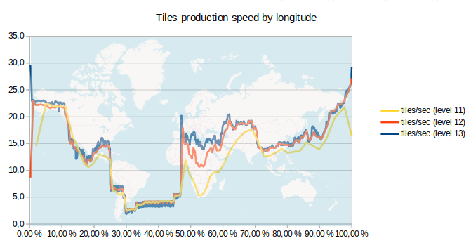

# osmtilemaker

## About

Generate your OSM tiles (one shot, no updates).

Follow the procedure below to:

* adapt configuration to suit your needs
* set up your local file system and download OSM raw data
* build and run a docker with all needed stuff
* import OSM data with osm2pgsql
* generate tiles with `scripts/gen-tile.py` (using [openstreetmap-carto](https://github.com/gravitystorm/openstreetmap-carto) and [Mapnik](https://mapnik.org/))

This procedure is inspired by [osmtilegen](https://github.com/nomadenorg/osmtilegen/) and `scripts/gen-tile.py` is adapted from [generate_tiles.py](https://github.com/openstreetmap/mapnik-stylesheets/blob/master/generate_tiles.py) using `argparse` python module.

Some commands are runned inside the docker container (through an interactive bash session) for convenience. If you want to package below procedure in one main script and avoid interactive bash session, there is not a long way.

## Requirements

### Hardware

For a full planet import, you can check

* [Wiki OSM - Osm2pgsql/benchmarks](https://wiki.openstreetmap.org/wiki/Osm2pgsql/benchmarks)
* [Frederik Ramm - Optimising theMapnik RenderingToolchain2.0](https://www.geofabrik.de/media/2012-09-08-osm2pgsql-performance.pdf)

Maybe the main constraint is your disk space as you have to host (size given for a full planet import in january 2020 with default config and a ZFS filesystem with `compression=lz4` and `recordsize=8k` for database):

* [49 GB] - planet.osm.pbf file
* [460 GB] - PostgreSQL/PostGIS OSM database peak usage (imported with osm2pgsql). End size: 185 GB.
* [53 GB] - osm2pgsql nodes cache
* tiles directory: [Geofabrik - Tile Calculator](http://tools.geofabrik.de/calc/) helps to estimate tiles size considering your bbox and zoom levels

`.conf/config` file allows you to host these resources under different base directories (for example if you want to mount multiple hard disks). Check these variables: `$HOSTPATH_OSM_FILE_DIR`, `$HOSTPATH_PG_DATA_DIR`, `$HOSTPATH_OSM2PGSQL_FLATNODE_DIR`, `$HOSTPATH_TILES_DIR`. Having an SSD disk especially for the database will fast up the process.

It seems that a good start is having 32GB RAM with 6 to 8 cores CPU.

### Software

* GNU/Linux Debian based system (tested with Debian 9 and Ubuntu 18.04).
* docker-ce version >=19 (tested with docker-ce 19.03.5), [official install doc](https://docs.docker.com/install/linux/docker-ce/debian/)

## Get source code and adapt configuration

* clone this repo (it will be mounted later as a `source` docker volume)
* go to root directory

```bash
cd osmtilemaker/
```

Config files are available under `./conf/` directory:

* `./conf/config`: main config file (examples: choose your .osm.pbf file, custom your area of interest, working directories location, database name ...)
* `./conf/postgres-settings.sh`: bash script to update postgresql.conf file with desired values

Because some osm2pgsql or PostgreSQL config variables impact performance: check  `About performance` section below to custom them to suit your needs.

* read config

```bash
. ./conf/config
```

**Be aware that you must read config files before immersing in following chapters.**

## Check requirements

* run this script **until** there is no error. It will check if all requirements are fullfilled and tell you what to do if necessary (as creating some directories or download an .osm.pbf file)

```bash
bash ./scripts/check_requirements.sh
```

## Build and run docker

```bash
sudo docker build \
--tag $DOCKER_BUILD_TAG \
--build-arg INSTALLWORKDIR=$DOCKER_BUILD_ARG_INSTALLWORKDIR \
docker
```
Before running next command, be aware of issue [#2](https://github.com/Magellium/osmtilemaker/issues/2) about `the --shm-size` parameter

```bash
sudo docker run -d \
  --env POSTGRES_PASSWORD=$DBPG_USER_POSTGRES_PWD \
  --env DBPG_USER_OSMTILEMAKER_USERNAME=$DBPG_USER_OSMTILEMAKER_USERNAME \
  --env DBPG_DATABASE_NAME=$DBPG_DATABASE_NAME \
  --volume $(pwd):$DOCKERPATH_SOURCE_DIR \
  --volume $HOSTPATH_WORKING_DIR:$DOCKERPATH_WORKING_DIR \
  --volume $HOSTPATH_OSM_FILE_DIR:$DOCKERPATH_OSM_FILE_DIR \
  --volume $HOSTPATH_PG_DATA_DIR:/var/lib/postgresql/data \
  --volume $HOSTPATH_OSM2PGSQL_FLATNODE_DIR:$DOCKERPATH_OSM2PGSQL_FLATNODE_DIR \
  --volume $HOSTPATH_TILES_DIR:$DOCKERPATH_TILES_DIR \
  --publish $DOCKER_HOST_PORT_TO_PUBLISH:5432 \
  --shm-size="256MB" \
  --name $DOCKER_NAME \
  $DOCKER_BUILD_TAG
```

You could check docker logs to be sure that everythings is ok

```bash
sudo docker logs $DOCKER_NAME
```

### Set postgres settings

```bash
sudo docker exec $DOCKER_NAME bash $DOCKERPATH_SOURCE_DIR/conf/postgres-settings.sh
# you must restart your container to restart postgres service (needed for parameters which require a restart to update, as `shared_buffers`)
sudo docker restart $DOCKER_NAME
# you can check that your postgresql.conf file has been correctly edited
sudo docker exec $DOCKER_NAME bash -c 'cat ${PGDATA}/postgresql.conf'
```

## Generate tiles

Let's start an interactive bash session inside `$SOURCE_DIR`.

```bash
sudo docker exec -it --workdir=$DOCKERPATH_SOURCE_DIR $DOCKER_NAME /bin/bash
```

***Next commands must be run inside the docker container***

### Read configuration inside your docker

```bash
. ./conf/config
```

### Create postgres user and database

```bash
sudo -u postgres bash $DOCKERPATH_SOURCE_DIR/scripts/init-db.sh
```

### Compile openstreetmap-carto Carto MML file to Mapnik XML

```bash
mv $DOCKER_BUILD_ARG_INSTALLWORKDIR/openstreetmap-carto $DOCKERPATH_WORKING_DIR/openstreetmap-carto
# update 'dbname: "gis"' in project.mml to match your $DBPG_DATABASE_NAME
sed -i -e"s/dbname: \"gis\".*$/dbname: \"$DBPG_DATABASE_NAME\"/" $DOCKERPATH_WORKING_DIR/openstreetmap-carto/project.mml
cd $DOCKERPATH_WORKING_DIR/openstreetmap-carto/ &&  carto --quiet project.mml >osm.xml
```

### Osm2pgsql import

```bash
# prepare command
OSM2PGSQL_CMD="osm2pgsql $OSM2PGSQL_OPTS $DOCKERPATH_OSM_FILE_DIR/$OSM_LATEST_FILE_NAME"
# check it
echo $OSM2PGSQL_CMD
# run
nohup $OSM2PGSQL_CMD >> $DOCKERPATH_WORKING_DIR/osm2pgsql.log 2>&1 &
# check log file
tail -f -n 200 $DOCKERPATH_WORKING_DIR/osm2pgsql.log
```

### Generate the tiles

Get shapefiles (processed coastline data as shapefile derived from OSM data is also needed for rendering usable map, more information at [Wiki OSM - Coastline error checker](https://wiki.openstreetmap.org/wiki/Coastline_error_checker))

```bash
$DOCKERPATH_WORKING_DIR/openstreetmap-carto/scripts/get-shapefiles.py
```

User postgres must be owner of your `$TILES_DIR`

```bash
chown postgres:postgres $DOCKERPATH_TILES_DIR
```

Running next command, you may notice some warnings like "warning: unable to find face-name 'Noto Sans ...". You can ignore this warnings, more information about this issue: [Missing fonts after following INSTALL.md #3655](https://github.com/gravitystorm/openstreetmap-carto/issues/3655#issuecomment-456972344).

```bash
nohup sudo -u postgres \
python $DOCKERPATH_SOURCE_DIR/scripts/gen-tile.py \
--bbox $BBOX \
--bbox_name $BBOX_NAME \
--mapfile $DOCKERPATH_WORKING_DIR/openstreetmap-carto/osm.xml \
--tile_dir $DOCKERPATH_TILES_DIR \
--minZoom $MINZOOM \
--maxZoom $MAXZOOM \
--num_threads $RENDERING_THREADS \
>> $DOCKERPATH_WORKING_DIR/gen-tile.log 2>&1 &
# check log file
tail -f -n 200 $DOCKERPATH_WORKING_DIR/gen-tile.log
```

## Reinitialization

Just in case you need to restart from a fresh docker instance

```bash
sudo docker stop $DOCKER_NAME
sudo docker rm $DOCKER_NAME
# You must remove $HOST_VOLUMES_BASE_DIR/$PG_DATA_DIR/ by yourself (don't use variables in commands to avoid errors)
```

## Preview with OpenLayers

***These commands must be run outside docker***

Requirements: you must have firefox and a web server running on localhost.

Move your tiles to your local webserver and then open `ol-example.html` (you could also use a symlink to avoid moving your tiles).

```bash
sudo mv $HOSTPATH_TILES_DIR /var/www/html/local-tiles
firefox ol-example.html
```

## About performance

### Useful links

* about osm2pgsql
  * [Volkerschatz -  osm2pgsql usage](http://www.volkerschatz.com/net/osm/osm2pgsql-usage.html)
  * [osm2pgsql usage docs](https://github.com/openstreetmap/osm2pgsql/blob/master/docs/usage.md)
* about osm2pgsql and PostgreSQL
  * [Frederik Ramm - Optimising theMapnik RenderingToolchain2.0](https://www.geofabrik.de/media/2012-09-08-osm2pgsql-performance.pdf)
  * [Wiki OSM - Osm2pgsql/benchmarks](https://wiki.openstreetmap.org/wiki/Osm2pgsql/benchmarks)
  * [PostgreSQL Wiki - Tuning Your PostgreSQL Server](https://wiki.postgresql.org/wiki/Tuning_Your_PostgreSQL_Server)
  * [Paul’s Blog - New Server PostgreSQL Tuning](http://www.paulnorman.ca/blog/2014/11/new-server-postgresql-tuning/)
  * [Paul’s Blog - ZFS Settings for Osm2pgsql](http://www.paulnorman.ca/blog/2014/11/zfs-settings-for-osm2pgsql/)

It's useful to know how many nodes OSM database contains: [Wiki OSM - Database statistics](https://www.openstreetmap.org/stats/data_stats.html).

### Suggestions

Below are some suggestions to customize configuration variables which impact osm2pgsql/PostgreSQL/gen-tile.py performances. It could be hard to know which values to choose as all provided advices throug links above are sometimes conflicting. If you think it could be improved, don't hesitate to contribute.

In `./conf/config` file

* `OSM2PGSQL_OPTS`
  * `--slim`: if you have enough RAM to store all nodes, you can consider to drop `--slim` option to speed up the import, according to [Volkerschatz -osm2pgsql usage](http://www.volkerschatz.com/net/osm/osm2pgsql-usage.html), each cached node requires 8 bytes of cache, plus about 10% to 30% overhead, so for ~5,7 billion nodes we need about 60GB RAM
  * `--drop`: to use with `--slim` because we do not need updates
  * `--flat-nodes`: "a binary file is used as a database of node locations". Useful to reduce database size and specify a file location (you can host it on a different hard disk). Warning: "This should only be used on full planet imports or very large extracts (e.g. Europe)" because "the file takes approximately 8 bytes * maximum node ID, or more than 50 GiB, **regardless** of the size of the extract." from [osm2pgsql usage docs](https://github.com/openstreetmap/osm2pgsql/blob/master/docs/usage.md))
  * `--cache`: "The rule of thumb in slim mode is as follows: use the size of the PBF file you are trying to import or about 75% of RAM, whatever is smaller. Make sure there is enough RAM left for PostgreSQL. It needs at least the amount of shared_buffers given in its configuration."(from [osm2pgsql usage docs](https://github.com/openstreetmap/osm2pgsql/blob/master/docs/usage.md)). Unit is MB.
  * `--number-processes`: [osm2pgsql usage docs](https://github.com/openstreetmap/osm2pgsql/blob/master/docs/usage.md) offical doc says "This should typically be set to the number of CPU threads, but gains in speed are minimal past 8 threads.". So we use as many threads as CPU cores we have (or more if your processor is hyperthreaded, `lscpu` command could be useful to know more about your processor)
  * `--disable-parallel-indexing`: not used in default config file, but could be useful ("disables the clustering and indexing of all tables in parallel. This reduces disk and RAM requirements during the import, but causes the last stages to take significantly longer.")
* `RENDERING_THREADS`: "rendering threads to spawn in gen-tile.py, should be roughly equal to number of threads available" says original [generate_tiles.py](https://github.com/openstreetmap/mapnik-stylesheets/blob/master/generate_tiles.py) tiles rendering script

In `./conf/postgres-settings.sh` file: maybe use [Paul’s Blog - New Server PostgreSQL Tuning](http://www.paulnorman.ca/blog/2014/11/new-server-postgresql-tuning/) recommendations.

About filesystem settings: using a ZFS filesystem for the hard disk hosting PostgreSQL database could speed up the import and reduce disk space usage (see [Paul’s Blog - ZFS Settings for Osm2pgsql](http://www.paulnorman.ca/blog/2014/11/zfs-settings-for-osm2pgsql/)). Recommended parameters are recordsize of 8K (run `zfs set recordsize=8k $your_pool`) and lz4 compression (run `zfs set compression=lz4 $your_pool`)

### Benchmarks

Note: feel free to add your own benchmark below, even with few details!

#### Full planet

##### Hardware and software configuration + osm2pgsql benchmarks

Available at [OSM Wiki - Osm2pgsql/benchmarks - Desktop Debian 9, 4 cores i5-6500 CPU @ 3.20GHz/32GB RAM, 1TB+500GB SSD (hstore slim drop flat-nodes and ZFS filesystem)](https://wiki.openstreetmap.org/wiki/Osm2pgsql/benchmarks#Desktop_Debian_9.2C_4_cores_i5-6500_CPU_.40_3.20GHz.2F32GB_RAM.2C_1TB.2B500GB_SSD_.28hstore_slim_drop_flat-nodes_and_ZFS_filesystem.29)

##### Tiles generation from level 1 to 12

Total: 415 hours ; 17,3 days ; ~ 13 957 698 tiles ; average speed : 9,34 tiles/sec ; 24,8 GB
Detail:
  * from level 1 to 10 : 40 hours ;  1,7 days ; ~ 850 000 tiles ; vitesse moyenne : 5,9 tiles/sec ; 870 MB
  * level 11 : 81 hours ; 3,4 days ; ~ 2 623 488 tiles ; average speed : 9 tiles/sec ; 1,9 GB
  * level 12 : 294 hours ; 12,3 days ; ~ 10 484 210 tiles ; average speed : 9,9 tiles/sec ; 22 GB
  
##### Speed by longitude from level 11 to 13


